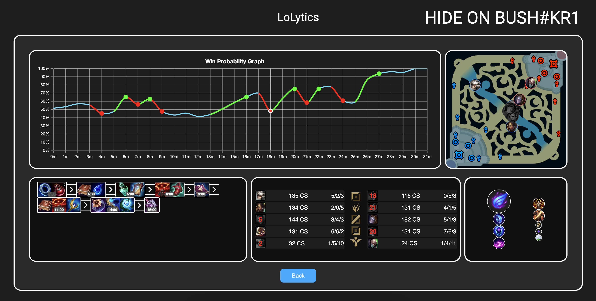
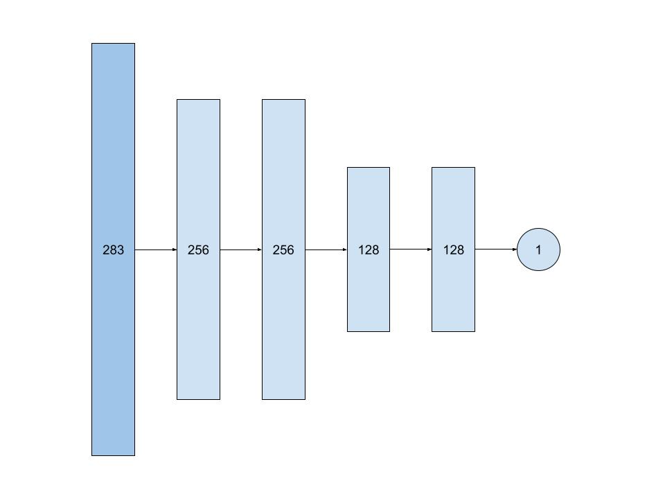
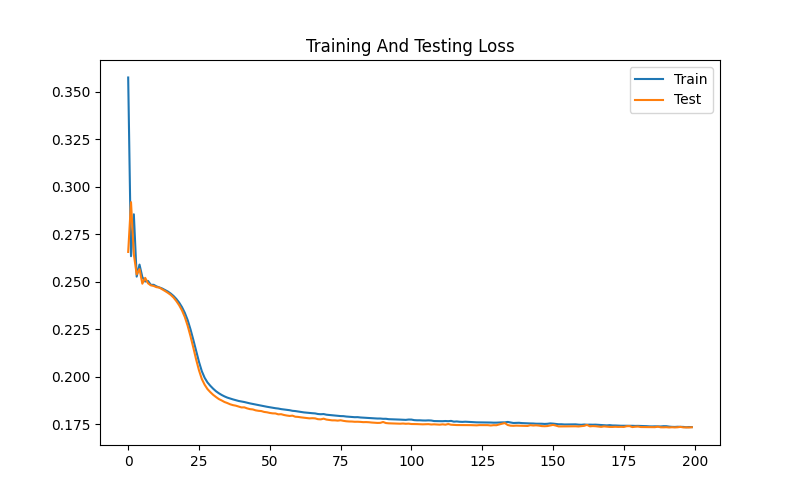
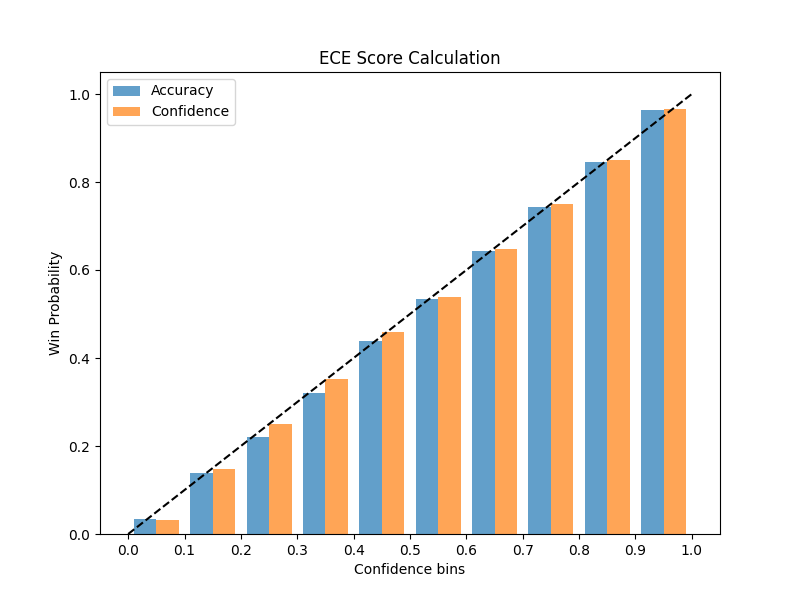
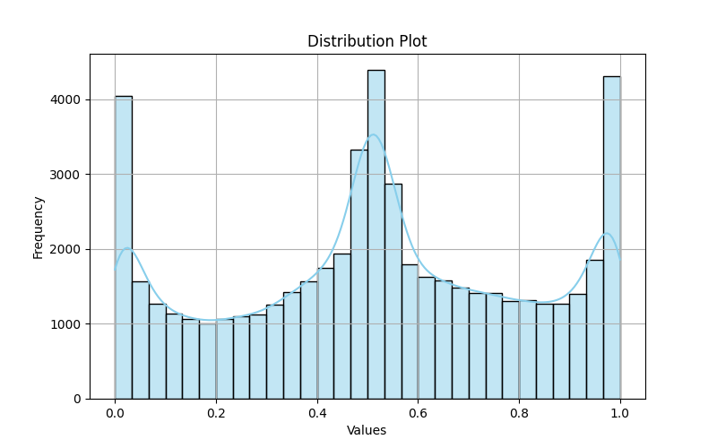
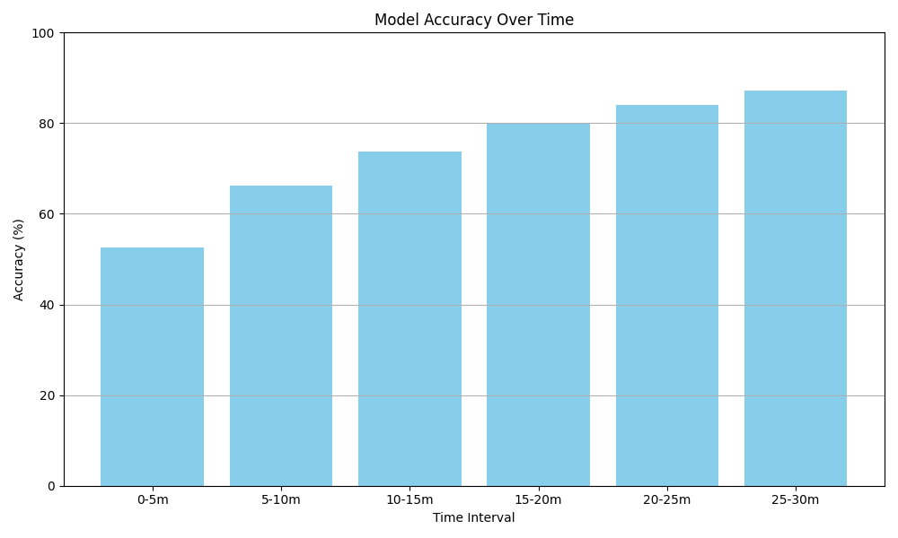
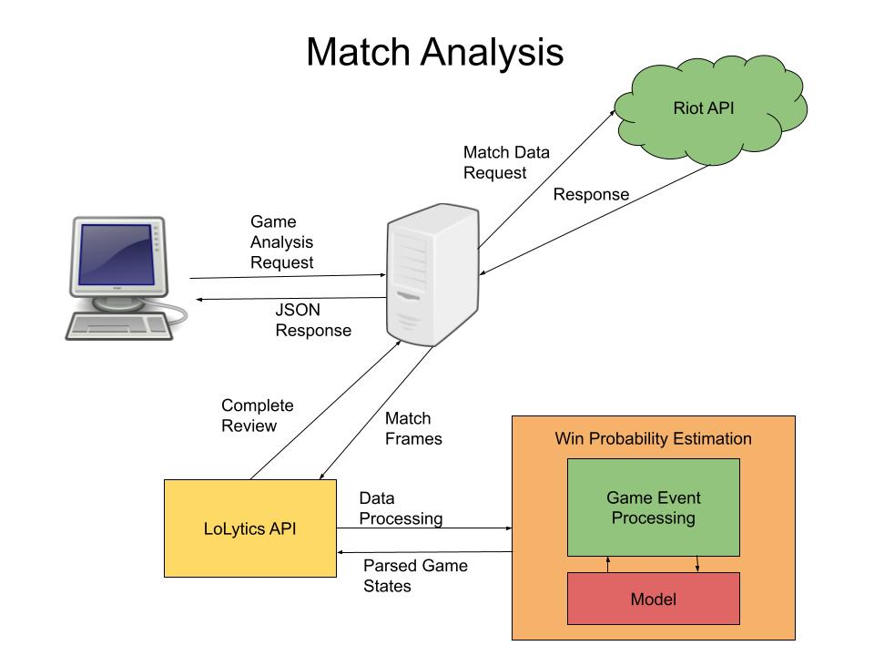

## LoLytics — League of Legends Analytics Platform
[](https://github.com/fqhd/LoLytics/actions/workflows/ci.yml)

**Live Demo:** [lolytics.org](https://lolytics.org)

Win probability and game state analytics for League of Legends, powered by machine learning.



---

### Technical Deep Dive
#### Dataset
A dataset of 540k unique ranked league of legends games was collected using the riot games API over the course of several hours due to rate limits. These games have been sampled from games played over the last 30 days from random users that are ranked between Platinum IV and Diamond I. Using the code under the `data/` directory, match information including game events were parsed into several game states corresponding to one per minute. As the data was being queried, a random minute was sampled from every game in order to get a distribution of game states uniformally distributed throughout the time dimension. The reason we don't sample every minute throughout every game is due to a team composition overfitting issue that is covered in the [Challenges](#challenges) section. Once these states have been downloaded, each one is stored in JSON format inside its corresponding rank folder for organization. Python code is then run to parse this JSON that is too slow to load in real time for training, into the much more efficient data format, [lmdb](https://www.symas.com/mdb).

#### Architecture



Interestingly, fully connected neural networks remain the state of the art for estimating win probability in league of legends games, over transformer architectures and time series models such as RNNs and LSTMs. Because of this, the best architecture we have found is composed of 5 layers, with 256 units in the first two, 128 in the second two, and one output neuron to store the expected win probability. The input layer is made up of 283 neurons because we concatenate game information with champion information separately. All game information aside from champion data can be encoded into 203 floats. Each champion is encoded as an 8-dimensional vector using a feature embedding layer. As there are 10 champions per game, this means all champion information can be concatenated into a vector of length 80. After concatenating champion information with game data information, the resuting vector has size 283 which is exactly the vector that is inputted into the neural network. This vector should accurately represent the current state of the game in a way that is both numerically stable, normalized using the means and standard deviations found in the `stats.json` file, and compact. Champions used to be encoded using their average game statistics such as physical and magical damage dealt, average kda, creepscore, etc. But this method did not represent champions well enough and tends to underfit compared to feature embeddings. This information may still be valuable in the future however, so it remains stored in the `data.csv` file under the `model/` directory. A different approach would be to use one hot encoded vectors, which is the technique used for encoding dragons taken. However, it is not practical for champions as that would require encoding the information using a 1710-dimensional vector which is simply far too sparse and will likely overfit quickly.

#### Training



The model was trained over 200 epochs, as that is roughly where it begins overfitting. The weights were checkpointed to the lowest validation loss. Many different hyperparameters were tried manually, and the best configuration found was using a learning rate of `1e-3` with the Adam optimizer, a batch size of `64`, and a binary crossentropy loss.

#### Challenges

As champions do not change throughout the course of the game, sampling the same game multiple times at different time intervals would likely vary every number in the game except for champion information which remains fixed. This causes the model to grow overconfident, overfit, and/or leak information between datasets. A simple regularization method fix to this problem would be to simply divide the gradients of the champion embedding vectors by the average number of minutes per game. Though this solution is valid, a far better approach would be to simply only query a single game state per game and increase the amount of games fetched.

### Metrics

In order to ensure the model is trust worthy, a set of metrics have been calculated to measure the models performance on the validation set. These include the model's [Accuracy](https://en.wikipedia.org/wiki/Accuracy_and_precision), output [Distribution](https://en.wikipedia.org/wiki/Distribution), and most notably, [Expected Calibration Error](https://en.wikipedia.org/wiki/Calibration_(statistics)).

#### ECE-Score



The orange bar on the right is the average prediction of the model within that bin, while the blue bar on the left represents the true accuracy of the game outcomes in that bin. Calculating the average difference between these two bars gives us the expected calibration error, or how "off" we can expect the outputs of the model to be. The current model has an ECE score of `1.02%` across 50k samples in the validation dataset.

#### Distribution

Although the model shows excellent calibration, it is important to also plot the average distribution of the outputs of the model as outputs closer to `50%` could artificially lower the ECE score without improving the models performance.



We notice the models outputs is indeed weighted towards the center and the sides with a small dip 25% above and below the mean. This could potentially be due to the snowbally nature of league of legends, combined with the fact early games generallt tend to be quite indecisive. These results alone are not too conclusive, alone, but they are enough to tell that the model is not overly strongly weighted towards 50% and does predict outputs towards the sides as well. 

#### Accuracy



Finally, we graph the model's accuracy over bins of 5 minute intervals. Naturally, it should be quite difficult to measure accuracy early on so we expect an accuracy of around 50% throughout the first five minutes. However, as the game continues, and advantages snowball, it becomes increasingly simpler to determine the team that is more likely to win. And that is reflected by the fact the models accuracy increase as time goes on. The fact the model can predict the outcome of a game at 20 minutes with over 80% accuracy signifies that the model is performing well.

### Deployment



Finally, in order to deploy the model, the [CI/CD](https://en.wikipedia.org/wiki/CI/CD) checks must first pass. These checks ensure the integrity of the model by comparing its outputs on a fixed set of inputs to ensure the python model predicts outputs the same result as when it is loaded in javascript. Since the data normalization is done within the pytorch model, the normalization tensors are saved as part of the [ONNX](https://onnx.ai/) version. Because of this, the normalization is handled automatically by the computation graph. The checks also test the game event parsing logic as these same functions that were used to download game data are the exact same that are used when parsing live game information. When the user executes a match analysis request, the server fetches the match data from the riot games api using match ID specified in the request. Once a response is drawn, the match is parsed into many game states, vectorized into an array of numbers(using a vectorization function which is also tested to be identical in python as it is in javascript), and then sent through the model to compute the win probability at every state. These states are further parsed to extract information such as item purchase history, runes, minimap, and scoreboard information. All this data is combined into one JSON object and returned back to the user to be displayed by the frontend.

### Usage

After Cloning the repository and installing dependencies with:
```bash
npm install
```
You can use the following commands:

1. `npm run dev` - Start development servers(client + backend)
1. `npm run dev:client` - Run frontend only
1. `npm run dev:server` - Run backend only
1. `npm run build` - Build frontend for production
1. `npm run preview` - Preview production build locally
1. `npm run lint` - Lint codebase
1. `npm run download` - Download dataset(requires Riot API key)
1. `npm test` - Run test suite

After downloading the dataset, generate a `train.lmdb` and `test.lmdb` test by running:
```bash
cd model
python create_lmdb_dataset.py
```

Once the dataset is downloaded and in the proper format you can train the model with:
```python
cd model && python train.py
```
Once trained, the model with the lowest validation loss should be saved under `model/dnn.pth`.

In order to use this model with the frontend, you must run `python convert.py` script while inside the model directory which will convert the model from `.pth` into `.onnx` so that it can be loaded into the node server.

> **Note:** Now is a good time to run `npm test` to ensure model integrity.

Finally, once you have a trained model, a set of scripts are available under the `model/` directory to calculate metrics such as temperature for improved calibration, accuracy, and expected calibration error.
