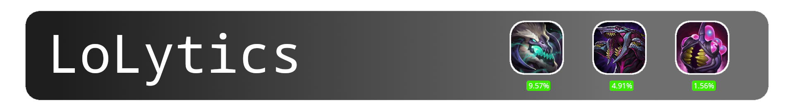

<h1 align="center">
    
</h1>

<p align="center">
    
    
    
</p>

## Description
LoLytics is a web app that helps review [League of Legends](https://www.leagueoflegends.com/) matches by empirically evaluating player performance at each point throughout a game. It highlights impactful moments using metrics like Win Probability Added (WPA) and points out the good plays and game losing mistakes.

The game review also displays detailed match data such as minimap information, scoreboard, and objective data, to allow for a comfortable game analysis.

LoLytics also analyzes large sets of games to research which objectives, items, roles, and champions have the biggest impact on winning.

Have questions or want to contribute? Join our [Discord](https://discord.gg/cqUKcvvX) community.
## Building
### Prerequisites
The process for building the project is the same on all platforms, ensure you are using node version 24 or later and you have the latest version of `pyenv` installed.

First, clone the repository:
```
git clone https://github.com/fqhd/LoLytics.git
```
This will download the main branch of the repo which contains the latest stable build of the site. If you are interested in contributing, make sure you fork the project and switch to the dev branch before making your changes.
### Building the Server
Make sure you are in the root directory of the project:
```
cd LoLytics
```

Now it's time to create your virtual environment with a recent version of python and install the packages required by the server.

Install a recent version of python:
```
pyenv install 3.12.2
```
Then, create and activate your environment:
```
pyenv virtualenv 3.12.2 lolenv
pyenv activate lolenv
```
And finally, with this environment active, install the required packages:
```
pip install -r requirements.txt
```
Now that you have all dependencies installed, to run the development server, ensure you are at the root of the project, and run one of the following commands depending on your operating system:
- Windows:
```
set NODE_ENV=development
python -m server.app
```
- Linux and MacOS:
```
NODE_ENV=development python -m server.app
```
> **Note:** Make sure to place your riot games API key in a .env file at the root of the project under the name `RIOT_KEY` or the server will not work.

### Building the Client
Building the client takes even less steps than building the server. All you really need to do is cd into the node project and install required node dependencies:
```
cd lolytics
npm install
```
Now, running a development server is as simple as:
```
npm run dev
```
If you would like to generate a production build, run `npm run build` instead, and the website bundle will be generated in the `dist/` directory.

### Testing
Currently, the only tests available are for the `dataset.py` and `game.py` modules as those are the parts which contain the core game logic and their functionality is of paramount importance.

However, it is still possible to run tests for those but you will first need to make sure you have `pytest` installed and configured for your system. If you are in the lolenv environment, simply run:

```
pip install pytest
```

Next, run the `pytest` command with the `PYTHONPATH` environment variable set to the root of the project. This can be accomplished by running the following command from the root of the project:
```
PYTHONPATH=. pytest
```

## Research
We also use the data collected to perform additional research about the game which you can find summarized in an article under the Research section. There aren't any strict rules under what areas to research or questions to answer using the data, as long as it is conducted in an unethical manner and you do not use the data to discriminate against or hurt any person or group of people.

That said, in the current state of the project, most of research efforts have gone into developing a machine learning model for win probability estimation. We use this model to calculate metrics like win probability added to assess the strength of each item and objective.

So far, we have tried 3 different machine learning models, DNN, XGBoost, and Linear Regression and evaluated each based on 4 metrics: Accuracy, Expected Calibration Error (ECE), Spread (SD), and Binary Cross-entropy.

|| Accuracy | ECE | SD | BCE |
|:-|:-:|:-:|:-:|:-:|
|**XGB**|72.57%|0.6%|0.2705|0.5155|
|**DNN**|73.09%|1.12%|0.2712|0.5086|
|**LR**|72.93%|0.39%|0.2784|0.5109|

Inside the Training notebook, you will find histograms that plot the output distribution of each model which is also considered when selecting the best model. (Currently Linear Regression)

### Calculating Win Probability Added
The code that calculates WPA for objectives and items can be found in the Research notebook, which also defines helper functions, namely `calc_average_event_wpa()` and `calc_first_event_wpa()` to assist you in calculating WPA for your own custom events. Average considers the possibility of the same event happening multiple times per game, whereas first only considers the first occurance of the target event.

Currently the only events for which we calculate WPA are defined in the same notebook in the form of function callbacks following this signature:

```python
def event_name(state, event):
    if condition: # Check target event match
        return True, teamId # Team executing event(0 or 1)
    return False, None
```

> Note: For the teamId variable in the code snippet above, 0 encodes the blue team and 1 is for red team.

## Training
If you would like to train your own model or try out other algorithms, there are predefined helper functions in the Training.ipynb notebook to help you get started.

### Downloading games
Currently, the only way to obtain a dataset of games is to download your own from the riot. The process to download games is in two steps, collecting match ids, and downloading the events.

While you are at the root of the project, run the script named `collect.js`. This will use the API key in your `.env` file to fetch unique match ids from ranks ranging from iron to master. The collection script processes match ids in batches so this operation should only take a couple minutes to complete.

Once the id collection script finishes running, it will save the ids in `match_ids.csv`, inspect this file to ensure its integrity before continuing. Once the contents have been verified, execute the download script and specify a test split to download the games (this is the part that takes the most time).
```
node download.js 0.2 # 20% of the ids will be placed in the test directory
```

### Creating an optimized dataset
After the matches have finished downloading, you can use the `dataset.py` script in the model package to generate a numpy dataset by sampling states at random points throughout each game.
```
python -m dataset.py
```
The resulting dataset will be saved in the root directory of the project.

## Features
- Account search
- Match history
- Purchase path
- Runes
- Events
- Scoreboard
- Minimap
- Game event parsing
- Global win probability graph
- Event specific win probability delta
- Neutral objective WPA
